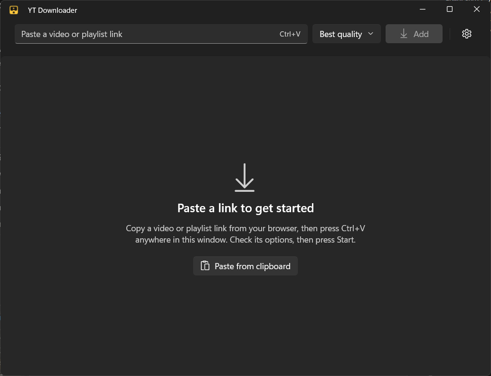

<p align="center">
  
</p>

<h1 align="center">YT Downloader</h1>

<p align="center">
  A fast, native Windows app for saving videos to watch offline.<br>
  Paste a link, pick a quality, press Start. Built with WinUI 3 on top of <a href="https://github.com/yt-dlp/yt-dlp">yt-dlp</a>.
</p>

<p align="center">
  <a href="https://github.com/RohanGupta15/grappler/actions/workflows/ci.yml"></a>
  <a href="https://github.com/RohanGupta15/grappler/releases/latest"></a>
  <a href="LICENSE"></a>
  
</p>

<p align="center">
  
</p>

## Features

- **One window, no clutter.** A link box, a quality picker and a live list grouped into Downloading, Up next, Playlists and Done.
- **You decide when it starts.** Added videos wait as "Ready to download" so you can check the options first. Start them one by one or all at once.
- **Quality your way.** Best available, a maximum height (1080p, 720p or 480p) or audio only (M4A or MP3). Video defaults to H.264 so it plays everywhere.
- **Extras per download.** Subtitles saved as `.srt`, sponsor segments removed with [SponsorBlock](https://sponsor.ajay.app/), or trim to just a clip.
- **Playlists.** Paste a playlist link and pick the videos you want.
- **Pause, resume, retry.** Pause keeps the partial file and picks up where it left off. Cancel cleans up after itself.
- **Parallel downloads.** Run 1 to 5 at once, with overall progress on the taskbar button and a notification when they finish.
- **Clipboard aware.** Copy a link in your browser, switch to the app, and it offers to add it. Ctrl+V works anywhere in the window.
- **Looks like Windows.** Fluent design with Mica, light and dark themes that follow Windows, and full keyboard use.
- **Keeps itself current.** The app updates itself from GitHub Releases, and Settings updates the download engine when sites change.

## Install

1. Go to the [latest release](https://github.com/RohanGupta15/grappler/releases/latest).
2. Download `YtDownloaderApp-win-x64-Setup.exe` and run it. It installs for your user only, needs no admin rights, and adds a Start menu entry and an uninstaller.
3. On first launch the app downloads its engine (yt-dlp, FFmpeg and Deno, about 250 MB). This happens once.

> [!NOTE]
> The installer is not signed with a paid code-signing certificate, so Windows SmartScreen may say "Windows protected your PC". Click **More info**, then **Run anyway**. You can check the download against the SHA-256 listed on the release page first.

Prefer a package? Each release also has a signed `.msix` and its certificate. See [Installing the MSIX](CONTRIBUTING.md#installing-the-msix) for the one-time certificate step.

**Requirements:** Windows 10 version 1809 or later, or Windows 11. x64 (ARM64 PCs run it under emulation).

## Build from source

You need Windows, the [.NET 9 SDK](https://dotnet.microsoft.com/download/dotnet/9.0) and Git. No Visual Studio or Developer Mode required.

```powershell
git clone https://github.com/RohanGupta15/grappler.git
cd grappler
dotnet test tests/YtDownloader.Core.Tests
pwsh ./scripts/run-dev.ps1
```

To build the installers yourself, see [Building installers](CONTRIBUTING.md#building-installers).

## How it works

```
src/YtDownloader.Core    engine download and verification, yt-dlp arguments, output parsing (no UI, fully tested)
src/YtDownloader.App     WinUI 3 app: MVVM view models, download queue, pages and controls
tests/                   xUnit tests for Core, run against captured yt-dlp output
scripts/                 run the app, build Setup.exe, build the MSIX
assets/logo/             logo masters and the script that renders the app icons
```

- On first run, `EngineManager` downloads yt-dlp, FFmpeg and Deno from their official GitHub releases and checks each against its published SHA-256 before using it. They live in `%LOCALAPPDATA%\YtDownloader\engine`.
- Each download runs yt-dlp as a separate process. The app reads its progress through a machine-readable `--progress-template`, so the UI never scrapes human-readable text.
- Deno is yt-dlp's JavaScript runtime for YouTube's player challenges. FFmpeg merges video and audio, converts subtitles and cuts clips.
- Settings are saved to `%LOCALAPPDATA%\YtDownloader\settings.json`.

## Roadmap

- [ ] Channel pages
- [ ] Download history that survives a restart
- [ ] ARM64 build

Ideas and bug reports are welcome in [Issues](https://github.com/RohanGupta15/grappler/issues).

## Contributing

Contributions are welcome. Read [CONTRIBUTING.md](CONTRIBUTING.md) to get set up, and follow the [Code of Conduct](CODE_OF_CONDUCT.md). Found a security problem? See [SECURITY.md](SECURITY.md).

## Acknowledgements

- [yt-dlp](https://github.com/yt-dlp/yt-dlp), which does the real work
- [FFmpeg](https://ffmpeg.org/) through [yt-dlp/FFmpeg-Builds](https://github.com/yt-dlp/FFmpeg-Builds), and [Deno](https://deno.com/)
- [Windows App SDK](https://github.com/microsoft/WindowsAppSDK) and [Windows Community Toolkit](https://github.com/CommunityToolkit/Windows)
- [Velopack](https://velopack.io/) for the installer and updates
- [SponsorBlock](https://sponsor.ajay.app/) for community sponsor segments

Licences for these are listed in [THIRD_PARTY_NOTICES.md](THIRD_PARTY_NOTICES.md).

## License

[MIT](LICENSE) © Rohan Gupta

## Disclaimer

YT Downloader is a personal project for personal use only. It is meant for saving videos you own, videos in the public domain or under a licence that allows downloading, and videos the creator has given you permission to keep.

**Do not use it for piracy.** Do not use it to download, copy or share content you don't have the right to, and do not use it to get around paywalls, DRM or other access controls. Downloading from YouTube and other sites may be against their terms of service. You are responsible for how you use this software and for following the laws of your country.

This project is not affiliated with, endorsed by or sponsored by YouTube or Google LLC. "YouTube" is a trademark of Google LLC and is used here only to describe what the app works with. The software is provided "as is", without warranty of any kind, as set out in the [licence](LICENSE).
